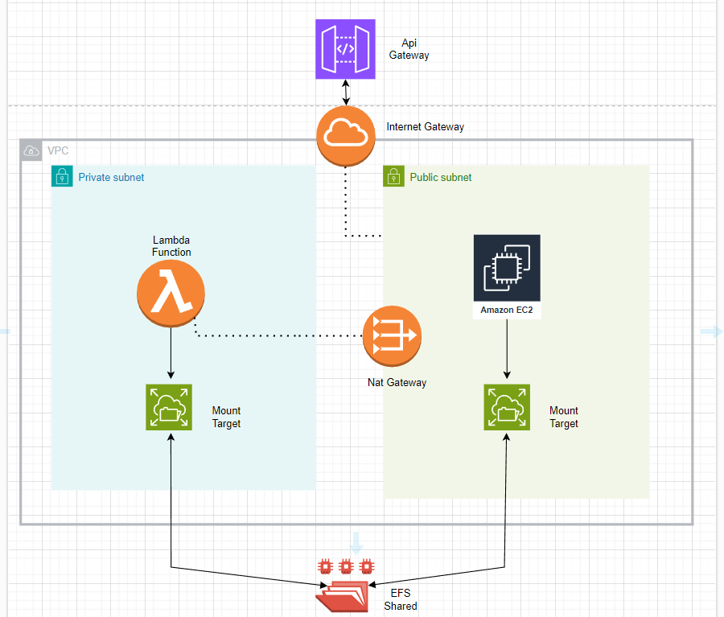
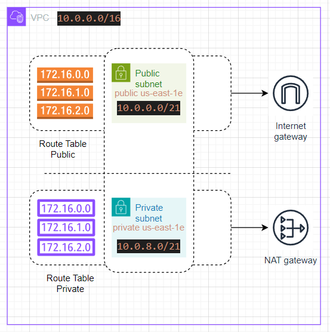

> **RESUMEN SERVICIOS AWS**

## EC2
Servidor virtual que permitira la instalacion de las librerias adicionales que requiera el lambda function.

## Elastic File System
Sistema de archivos que permite el almacenamiento de las librerias, puede montarse desde cualquier EC2 y asociarlo con la funcion lambda que se requiera.

## Lambda
Servicio que permitira ejecutar la logica de la aplicacion y que evita la administracion de un servidor, ya que ello es totalmente adminstrado por aws.

## Keypair
Pares de claves (privada y publica) que permite crear el recurso EC2 y conectar a la instancia EC2 por protocolo de administracion remota ssh, estos se guardan dentro de aws para su posterior uso. 

## Virtual Private Cloud
Estructura de red virtual que usa la infraestructura, se conforma por una subred publica y una subred privada, adicionalmente se configuro un internet gateway y un nat gateway respecticamente, para cada uno de ellos.

- Subnet Publica: Tiene como finalidad dar salida a internet a la instancia EC2 para la instalacion de librerias por consola web.
- Subred Privada: Tiene como finalidad rutear la solicitud al nat gateway.
- Internet Gateway: Tiene como finalidad conectar el servicio al api gateway.
- Nat Gateway: Tiene ocmo finalidad rutear la solicitud del lambda function a la subred publica y viceversa.

## Api Gateway
Servicio que sirve de gestor de apis y funciona como proxy inverso para las aplicaciones, para este caso el lambda function conectara su funcion con un servicio de este.

> **Recursos adicionales**
## Llaves
- Llave publica: Creacion del recurso de terraform
- Llave privada: Conexion al EC2
`Puede generarlo localmente o generarlo mediante la consola de aws.`

## Script de funcion
- Para este caso se tiene un solo script llamado lambda_function.py, donde esta toda la logica del servicio de prediccion

## Terraform.tfvars
- Archivo donde se almacenara todas las variables de entorno necesarias que requiera la funcion lambda.

-----------------------------------------------------------------------------------
> **Requerimientos**
 - Instalar AWS Cli v2.15.48 y Python/3.11.8
 - Instalar Terraform v1.9.0

>  **Configuracion AWS**
1. Ejecutar `aws configure --profile NOMBRE_DEL_PERFIL` donde "NOMBRE_DEL_PERFIL" es el perfil de despliegue con localstack.
2. Ingresar las credenciales respectivas : 
    - access_key
    - secret_key
    - region
    - ouput format

>  **Pasos para construccion de la infrastructura**
1. Actualizar la funcion lambda de nombre `lambda_function.py` segun sus necesidades y anotar las librerias en el archivo `requirements.txt` para llevar un historial de los mismos.
2. Ubicarse en el modulo `efs` y ubicar el recurso `configure_nfs` luego agregar la libreria asociada a su cambio en la linea `pip3 install --upgrade --target /home/ubuntu/efs xxnueva_libreriaxx psycopg2-binary scikit-learn mysql-connector-python openai pandas requests pdfminer.six numpy"`
2. Ubicarse en la carpeta `infrastructure` y completar las variables con credenciales respectivas en el archivo terraform.tfvars
3. Ejecutar `terraform init` y seguidamente `terraform apply -auto-approve`.

**Nota: Entrar a la instancia ec2 y dar permisos a la carpeta que sirve de montaje con el siguiente codigo: "sudo chmod -R 777 /home/ubuntu/efs" luego correr el paso 2, esto con la finalidad de instalar las librerias**

## Diagrama de Arquitectura

## Network
Las subredes se dividen en redes /21. Las redes privadas privadas son para la funcion lambda que debe tener una IP fija. Las redes públicas ejecutan las otras instancias del clúster.

## Firewall
Las reglas del firewall se definen en el Grupo de Seguridad.

